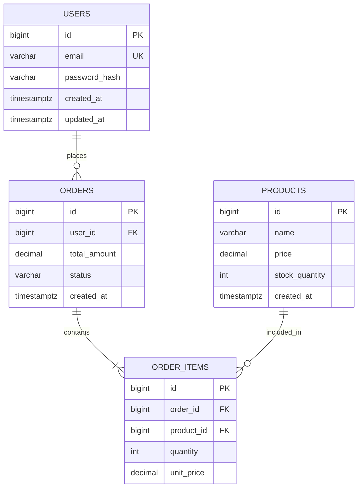

# Relational Database Design

## Table of Contents
1. [Naming Conventions](#naming-conventions)
2. [Data Types](#data-types)
3. [Normalization (Normal Forms)](#normalization)
4. [Entity Relationships](#entity-relationships)
5. [ERD với Mermaid](#erd-mermaid)
6. [Constraints & Integrity](#constraints)
7. [Primary & Foreign Keys](#keys)

---

## 1. Naming Conventions

### Bảng (Tables)
```
✅ Dùng: snake_case, số nhiều (plural)
✅ users, orders, order_items, product_categories
❌ Tránh: User, tblOrders, orderItems, ORDER_TABLE
```

### Cột (Columns)
```
✅ snake_case, mô tả rõ ràng
✅ user_id, first_name, created_at, is_active
❌ Tránh: userId, fname, ts, flag1
```

### Primary Key
```
✅ Luôn đặt tên là: id
✅ Không dùng: user_id làm PK trong bảng users (chỉ dùng id)
```

### Foreign Key
```
✅ {tên bảng tham chiếu số ít}_id
✅ user_id, product_id, category_id, order_id
```

### Boolean Columns
```
✅ Bắt đầu bằng: is_, has_, can_, should_
✅ is_active, has_verified_email, is_deleted
```

### Timestamp Columns
```
✅ created_at    — khi record được tạo
✅ updated_at    — khi record được cập nhật lần cuối
✅ deleted_at    — cho soft delete
✅ published_at  — khi được publish
✅ expires_at    — khi hết hạn
```

---

## 2. Data Types

### Lựa chọn Data Type đúng

| Loại dữ liệu | PostgreSQL | MySQL | Ghi chú |
|---|---|---|---|
| ID (auto) | `BIGSERIAL` | `BIGINT UNSIGNED AUTO_INCREMENT` | Cho hệ thống nhỏ-vừa |
| ID (phân tán) | `UUID` | `CHAR(36)` hoặc `BINARY(16)` | Cho microservices, phân tán |
| Tên ngắn | `VARCHAR(255)` | `VARCHAR(255)` | |
| Mô tả dài | `TEXT` | `TEXT` | Không cần độ dài |
| Email | `VARCHAR(254)` | `VARCHAR(254)` | RFC 5321 max 254 chars |
| Số nguyên nhỏ | `SMALLINT` | `SMALLINT` | -32768 đến 32767 |
| Số nguyên thường | `INTEGER` | `INT` | |
| Số nguyên lớn | `BIGINT` | `BIGINT` | IDs, counters lớn |
| Tiền tệ | `DECIMAL(19,4)` | `DECIMAL(19,4)` | KHÔNG dùng FLOAT/DOUBLE |
| Phần trăm | `DECIMAL(5,2)` | `DECIMAL(5,2)` | VD: 99.99 |
| Boolean | `BOOLEAN` | `TINYINT(1)` | |
| Ngày giờ | `TIMESTAMPTZ` | `DATETIME` | Luôn lưu UTC |
| Chỉ ngày | `DATE` | `DATE` | |
| JSON | `JSONB` | `JSON` | PG dùng JSONB để query được |
| File path | `TEXT` | `VARCHAR(2048)` | Không lưu binary trong DB |
| IP Address | `INET` | `VARCHAR(45)` | PostgreSQL có type INET native |
| Enum | `VARCHAR` + CHECK | `ENUM(...)` | PG tránh dùng ENUM type vì khó migrate |

### ⚠️ Những lỗi phổ biến về Data Type
```sql
-- ❌ SAI: Dùng float cho tiền
price FLOAT  -- floating point errors!

-- ✅ ĐÚNG:
price DECIMAL(19, 4)

-- ❌ SAI: Lưu boolean như string
is_active VARCHAR(5) -- 'true', 'false', 'True', 'yes'...

-- ✅ ĐÚNG:
is_active BOOLEAN NOT NULL DEFAULT FALSE

-- ❌ SAI: VARCHAR cho số
phone_number VARCHAR(20) -- có thể OK, nhưng đừng lưu số theo kiểu tính toán
zip_code INT -- sẽ mất số 0 đầu: 01234 → 1234

-- ✅ ĐÚNG:
phone_number VARCHAR(20) -- phone là string, không phải số
zip_code VARCHAR(10)     -- zip là string có thể có 0 đầu
```

---

## 3. Normalization (Chuẩn Hóa)

### 1NF — First Normal Form
**Quy tắc:** Mỗi cột chỉ chứa một giá trị atomic (không có arrays, không có repeated groups)

```sql
-- ❌ Vi phạm 1NF
CREATE TABLE orders (
  id INT,
  product_names TEXT  -- 'Áo, Quần, Giày' — nhiều giá trị trong 1 cột!
);

-- ✅ Đạt 1NF
CREATE TABLE order_items (
  id BIGINT PRIMARY KEY,
  order_id BIGINT NOT NULL,
  product_id BIGINT NOT NULL
);
```

### 2NF — Second Normal Form
**Quy tắc:** Đạt 1NF + mọi cột non-key phải phụ thuộc hoàn toàn vào toàn bộ PK (loại bỏ partial dependency)

```sql
-- ❌ Vi phạm 2NF (PK là order_id + product_id nhưng product_name chỉ phụ thuộc product_id)
CREATE TABLE order_items (
  order_id BIGINT,
  product_id BIGINT,
  product_name VARCHAR(255),  -- chỉ phụ thuộc product_id, không phụ thuộc order_id!
  quantity INT,
  PRIMARY KEY (order_id, product_id)
);

-- ✅ Đạt 2NF — tách product_name ra bảng products
CREATE TABLE products (
  id BIGINT PRIMARY KEY,
  name VARCHAR(255) NOT NULL
);

CREATE TABLE order_items (
  id BIGINT PRIMARY KEY,
  order_id BIGINT NOT NULL,
  product_id BIGINT NOT NULL,
  quantity INT NOT NULL
);
```

### 3NF — Third Normal Form
**Quy tắc:** Đạt 2NF + không có transitive dependency (A → B → C thì B và C phải vào bảng riêng)

```sql
-- ❌ Vi phạm 3NF
CREATE TABLE employees (
  id BIGINT PRIMARY KEY,
  name VARCHAR(255),
  department_id INT,
  department_name VARCHAR(255),  -- transitive: id → department_id → department_name
  department_budget DECIMAL
);

-- ✅ Đạt 3NF
CREATE TABLE departments (
  id INT PRIMARY KEY,
  name VARCHAR(255) NOT NULL,
  budget DECIMAL(15,2)
);

CREATE TABLE employees (
  id BIGINT PRIMARY KEY,
  name VARCHAR(255),
  department_id INT REFERENCES departments(id)
);
```

### BCNF — Boyce-Codd Normal Form (Khi nào cần)
Chỉ cần thiết khi có nhiều candidate keys overlap nhau. Trong thực tế, đạt 3NF là đủ cho hầu hết hệ thống.

### Khi nào được phép Denormalize?
Denormalize có chủ đích (intentional denormalization) là OK khi:
- Đã profile và confirmed performance bottleneck
- Bảng read-heavy, ít write
- Report/analytics tables (OLAP)
- Caching layer
- Luôn document lý do tại sao denormalize

---

## 4. Entity Relationships

### One-to-One (1:1)
```sql
-- Ví dụ: users và user_profiles
-- Cách 1: Cùng bảng (nếu always exists)
-- Cách 2: Bảng riêng với FK UNIQUE (nếu optional hoặc nhiều cột)

CREATE TABLE users (
  id BIGSERIAL PRIMARY KEY,
  email VARCHAR(254) UNIQUE NOT NULL,
  created_at TIMESTAMPTZ NOT NULL DEFAULT NOW()
);

CREATE TABLE user_profiles (
  id BIGSERIAL PRIMARY KEY,
  user_id BIGINT UNIQUE NOT NULL REFERENCES users(id) ON DELETE CASCADE,
  -- UNIQUE constraint biến đây thành 1:1
  bio TEXT,
  avatar_url TEXT,
  date_of_birth DATE
);
```

### One-to-Many (1:N) — Phổ biến nhất
```sql
-- Ví dụ: một user có nhiều orders
CREATE TABLE orders (
  id BIGSERIAL PRIMARY KEY,
  user_id BIGINT NOT NULL REFERENCES users(id),
  -- FK ở phía "Many"
  total_amount DECIMAL(19,4) NOT NULL,
  status VARCHAR(50) NOT NULL DEFAULT 'pending',
  created_at TIMESTAMPTZ NOT NULL DEFAULT NOW()
);

-- Index FK!
CREATE INDEX idx_orders_user_id ON orders(user_id);
```

### Many-to-Many (N:M) — Qua Junction Table
```sql
-- Ví dụ: products và categories
CREATE TABLE product_categories (
  -- Junction table
  product_id BIGINT NOT NULL REFERENCES products(id) ON DELETE CASCADE,
  category_id BIGINT NOT NULL REFERENCES categories(id) ON DELETE CASCADE,
  PRIMARY KEY (product_id, category_id),  -- Composite PK
  created_at TIMESTAMPTZ NOT NULL DEFAULT NOW()
  -- Có thể thêm metadata vào junction table
);

CREATE INDEX idx_product_categories_category_id ON product_categories(category_id);
```

### Self-Referencing (Hierarchical / Tree)
```sql
-- Ví dụ: categories có thể có subcategories, comments có thể có replies
CREATE TABLE categories (
  id BIGSERIAL PRIMARY KEY,
  parent_id BIGINT REFERENCES categories(id) ON DELETE SET NULL,
  -- NULL = root category
  name VARCHAR(255) NOT NULL,
  slug VARCHAR(255) UNIQUE NOT NULL
);

CREATE INDEX idx_categories_parent_id ON categories(parent_id);
```

---

## 5. ERD với Mermaid

### Template ERD chuẩn


### Ký hiệu Mermaid ERD
```
||--||    Exactly one to exactly one
||--o{    Exactly one to zero or more
||--|{    Exactly one to one or more
o{--o{    Zero or more to zero or more
```

---

## 6. Constraints & Integrity

```sql
-- NOT NULL — Cột bắt buộc có giá trị
email VARCHAR(254) NOT NULL

-- UNIQUE — Không được trùng
email VARCHAR(254) UNIQUE NOT NULL
-- Hoặc composite unique:
UNIQUE (user_id, role)

-- CHECK — Kiểm tra điều kiện
age INT CHECK (age >= 0 AND age <= 150)
status VARCHAR(20) CHECK (status IN ('active', 'inactive', 'banned'))
price DECIMAL(19,4) CHECK (price >= 0)

-- DEFAULT — Giá trị mặc định
is_active BOOLEAN NOT NULL DEFAULT TRUE
created_at TIMESTAMPTZ NOT NULL DEFAULT NOW()
status VARCHAR(20) NOT NULL DEFAULT 'pending'

-- Foreign Key với Cascade rules
user_id BIGINT NOT NULL REFERENCES users(id)
  ON DELETE CASCADE    -- Xóa user → tự xóa luôn records liên quan
  ON DELETE SET NULL   -- Xóa user → set FK = NULL
  ON DELETE RESTRICT   -- Không cho xóa nếu còn FK references (default)
  ON UPDATE CASCADE    -- Cập nhật PK → tự cập nhật FK
```

---

## 7. Primary & Foreign Keys

### UUID vs BIGINT — Khi nào dùng gì?

| Tiêu chí | UUID | BIGINT AUTO_INCREMENT |
|---|---|---|
| Performance | Chậm hơn (random, index fragmentation) | Nhanh hơn (sequential) |
| Security | Tốt hơn (không đoán được ID) | Kém hơn (sequential có thể đoán) |
| Phân tán | Tốt cho microservices | Cần coordination |
| Storage | 16 bytes (binary) / 36 bytes (string) | 8 bytes |
| Readability | Khó đọc | Dễ đọc |
| **Khuyến nghị** | Microservices, public APIs, phân tán | Monolith, internal systems, performance-critical |

```sql
-- PostgreSQL UUID
CREATE TABLE users (
  id UUID PRIMARY KEY DEFAULT gen_random_uuid(),
  ...
);

-- PostgreSQL BIGINT
CREATE TABLE users (
  id BIGSERIAL PRIMARY KEY,
  ...
);

-- MySQL
CREATE TABLE users (
  id BIGINT UNSIGNED NOT NULL AUTO_INCREMENT PRIMARY KEY,
  ...
);
```

### Composite Primary Key — Khi nào dùng?
```sql
-- Chỉ dùng cho pure junction tables, không thêm gì khác vào bảng đó
CREATE TABLE user_roles (
  user_id BIGINT NOT NULL REFERENCES users(id) ON DELETE CASCADE,
  role_id INT NOT NULL REFERENCES roles(id) ON DELETE CASCADE,
  PRIMARY KEY (user_id, role_id)
);

-- Nếu junction table có thêm data, hãy dùng surrogate PK
CREATE TABLE order_items (
  id BIGSERIAL PRIMARY KEY,  -- surrogate key
  order_id BIGINT NOT NULL REFERENCES orders(id),
  product_id BIGINT NOT NULL REFERENCES products(id),
  quantity INT NOT NULL,
  unit_price DECIMAL(19,4) NOT NULL,  -- lưu giá tại thời điểm đặt
  UNIQUE (order_id, product_id)  -- vẫn enforce uniqueness
);
```